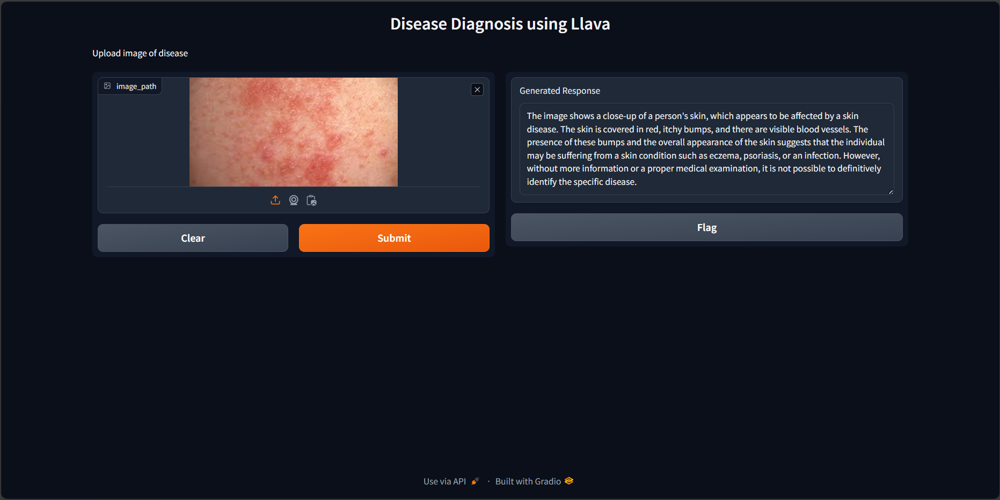

# Disease Diagnosis Using Llava

This project leverages the Llava model for disease diagnosis by converting medical images to descriptive text. The pipeline is optimized for efficiency with 4-bit quantization, making it both powerful and resource-efficient.

## Project Overview

Medical diagnosis often relies on the interpretation of images, such as X-rays, MRIs, or photos of skin conditions. Traditionally, this requires the expertise of trained medical professionals. This project aims to assist in the diagnostic process by using an advanced Large Multimodal Model to generate textual descriptions of disease symptoms and possible diagnoses based on input images.

## How It Works



1. **Image Input**: The system accepts an image related to a medical condition.
2. **Text Generation**: The Llava model, configured with 4-bit quantization for efficiency, processes the image and generates a detailed description.
3. **Output**: The generated text includes observed symptoms and potential diagnoses, aiding healthcare professionals in decision-making.

## Features

- **Efficiency**: Using 4-bit quantization significantly reduces the computational resources required, making it feasible to run on less powerful hardware.
- **Speed**: The pipeline provides rapid analysis, which is crucial in medical settings where time is often of the essence.
- **Support for Healthcare Professionals**: The generated descriptions can serve as a second opinion or a preliminary analysis, helping doctors and specialists in their diagnostic processes.
- **Accessibility**: This tool can be particularly useful in remote or under-resourced areas where access to specialist medical professionals is limited.

## Setup

1. **Install Dependencies**

   Required dependencies need to be installed. This can be done by:
   ```bash
   pip install torch transformers nltk
   ```

2. **Download nltk data**

   NLTK is used for sentence tokenization. Download the required data using:
   ```python
   import nltk
   nltk.download('punkt')
   ```

3. **Quantization Configuration**

   For effective and optimized performance, quantization is used. This can be achieved by:
   ```python
   from transformers import BitsAndBytesConfig

   quantization_config = BitsAndBytesConfig(
       load_in_4bit=True,
       bnb_4bit_compute_dtype=torch.float16
   )
   ```

4. **Pipeline Initialisation**
   
   Pipe object is created by callng ```pipeline()``` function from HuggingFace Transformers Library. The 
   specified task is "image-to-text" and Llava model is used.
   ```python
   from transformers import pipeline

   model_id = "llava-hf/llava-1.5-7b-hf"
   
   pipe = pipeline("image-to-text",
                   model=model_id,
                   model_kwargs={"quantization_config": quantization_config})
   ```

5. **Prompt Instructions***

   Prompt instructions has been created in correspondence with our specified task of disease diagnosis.
   ```python
   prompt_instructions = "Describe the disease symptoms and possible diagnosis based on the image."
   prompt = "USER: <image>\n" + prompt_instructions + "\nASSISTANT:"

6. **Output Text Generation**

   Output text has been generated using the following command:
   ```python
   outputs = pipe(image, prompt=prompt, generate_kwargs={"max_new_tokens": 200})
   ```

